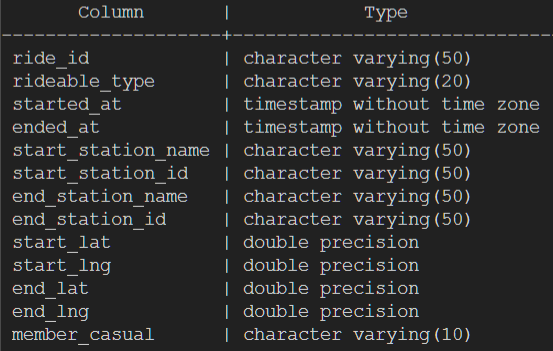

# Google Data Analytics Capstone Project: Case Study Cylicstic

## Introduction
**Cylistic** is a A bike-share program that features more than **5,800 bicycles and 600 docking stations**. Cyclistic sets itself
apart by also offering reclining bikes, hand tricycles, and cargo bikes, making bike-share more inclusive to people with
disabilities and riders who can’t use a standard two-wheeled bike. The majority of riders opt for traditional bikes; about
8% of riders use the assistive options. Cyclistic users are more likely to ride for leisure, but about 30% use them to
commute to work each day.

Until now, Cyclistic’s marketing strategy relied on building general awareness and appealing to broad consumer segments.
One approach that helped make these things possible was the flexibility of its pricing plans: single-ride passes, full-day passes,
and annual memberships. Customers who purchase single-ride or full-day passes are referred to as **casual riders**. Customers
who purchase annual memberships are **Cyclistic members**.

## Ask
The director of marketing believes the company's future success depends on **maximizing the number of annual memberships**. Then my team will design a new marketing strategy to convert casual riders into annual members. As a junior data analyst, I was assigned to answer the business question **"How do annual members and casual riders use Cyclistic bikes differently"**. 

## Prepare
I used the **Cyclistic’s historical trip data** to analyze and identify trends. The datasets have a different name because Cyclistic is a fictional company. For the purposes of this case study, the datasets are appropriate and will be enable to answer the business questions. The data has been made available by **Motivate International Inc**.

For this project, i downloaded **12 CSV files** comprising data from **July to December 2022 and January to June 2023**. This latest data improves analysis by providing more up-to-date insights, trends, and patterns. It takes into account recent changes, behaviors, and events, which can lead to more accurate and relevant conclusions.

# Process
I used **PostgreSQL** on **PGAdmin 4** to combine and clean the data.

### Data Combination
You can view my queries for data combination [here](combine_datasets.sql)
1. Created **12 tables** for each dataset and copy the CSV files to the tables.

2. Combined all 12 tables into one table called **'combined_tripdata'**. The combined table contains 5.779.444 rows and has 13 columns. Below is the name of each column and its data type.

### Data Exploration

I ran queries on each column, documenting data that required cleaning. You can view my queries Here [here](data_exploration.sql) on GitHub. Here's a brief overview of my findings:

* **ride_id**: it consist of 16 characters, uniformly across all entry, totaling 5.779.444 entry. This aligns with the total dataset count, where each ride_id is unique.

* **rideable_type**: identified three distinct bike types: classic_bike, docked_bike, and electric_bike. Notably, docked bike is used by casual riders only, and it has 141.535 entry (Just 2% of the overall data). I change these entry to classic_bike.

* **started_at and ended_at**: these columns show the date and time that bike trips started/ended. There are no null values in these columns. There are 155.873 entry where the ride-time of the trip was less than one minute or greater than one day, which i removed for our analysis process.

* **start_station_name, start_station_id, end_station_name, and end_station_id**: there are 1.370.099 entry that has null values in either the starting station name or ending station name. Of these trips, 5.856 entry were classic_bike and docked_bike trips. These trips will be removed as both type of bike should start and end at a station. However electric_bike yielded an extensive 1.364.243 entry.

* **start_lat, start_lng, end_lat, and end_lng**: these columns show the starting and ending location of the bike trips. There are 5.795 entry that has null values, and they will be removed.

* **member_casual**: this column specifies wether the trip's customer is a casual riders or annual member. I checked that only 'casual' and 'member' are permissible entries in this column.

### Data Cleaning

Upon completing the initial data exploration, I've identified which data requiring cleaning and which columns can be created to enhance our analysis. You can view my queries [here](data_cleaning.sql) on Github. Here's a brief overview of the cleaning steps that i took:
1. removed trip that less than/equal to one minute and more than/equal to one day.
2. removed trip where the type of bike used are classic_bike and docked_bike and they don't have start or end station.
3. removed trips that had null vales in either its start_lat, start_ltd, end_lat, end_ltd
4. replaced 'docked_bike' entries to 'classic_bike' on rideable_type column.
5. created a ride_time column that calculate each trip time.
6. created month, day_of_week, hour to assist our analysis.
The combined and cleaned table has 5.622.690 rows.

## Analyze

As the data now thoroughly cleaned , it's time to analyze the data and answer the question: **"How do annual members and casual riders use Cyclistic bikes differently?"**

To conduct this analysis, I used **SQL** to sort, filter, and aggregate the data. You can access my SQL analysis queries [here](analyze.sql). 

## Share

I utilized Tableau to visualize the outcomes of the earlier analysis queries. You can access all my Tableau visualizations [here](https://public.tableau.com/app/profile/fahmi.sabila.firdaus/viz/GoogleDataAnalyticsCapstoneProjectCaseStudy1Cylistic/Sheet7).

### Total Rides by Bike Types

### Total Rides by Months

### Total Rides by Day of Week

### Total Rides by Hour

### Average Ride Time

### Ride Frequency by Starting Stations

    
    

### Ride Frequency by Ending Stations

    
    

## Act
